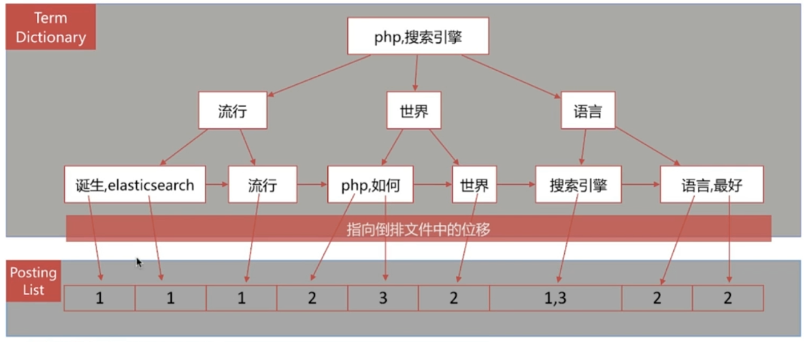

### 书的目录与索引
目录 - 正排索引

文档id到文档中内容和关键词的关系

| 文档id | 文档内容                   |
|------|------------------------|
| 1    | ElasticSearch是最流行的搜索引擎 |
| 2    | php是世界上最好的语言           |
| 3    | 搜索引擎是如何诞生的             |

索引 - 倒排索引

单词到文档id的关联关系

| 单词            | 文档id列表 |
|---------------|--------|
| elasticsearch | 1      |
| 流行            | 1      |
| 搜索引擎          | 1，3    |
| php           | 2      |
| 世界            | 2      |
| 最好            | 2      |
| 语言            | 2      |
| 如何            | 3      |
| 诞生            | 3      |

查询包含“搜索引擎”的文档
- 通过倒排索引获得“搜索引擎”对应的文档id有1，3
- 通过正排索引查询1和3的完整内容
- 返回给用户最终结果

### 倒排索引
倒排索引是搜索引擎的核心
- 单词词典(Term Dictionary)
    
    - 记录所有文档的单词，一般都比较大
    - 记录单词到倒排列表的关联信息
     
- 倒排列表(Posting List)

    倒排列表记录了单词对应文档的集合，由倒排索引项组成
    
    倒排索引项Posting主要包括如下信息
    
    - 文档id  用于获取原始信息
    - 单词频率  Term Frequency,记录单词在该文档中出现的次数
    - 位置 Position,记录单词在文档中的分词位置，用于词语搜索(Phrase Query)
    - 偏移 Offset,记录单词在文档的开始和结束位置，用于高亮显示
    
### 倒排索引到倒排列表
| 文档id | 文档内容                   |
|------|------------------------|
| 1    | ElasticSearch是最流行的搜索引擎 |
| 2    | php是世界上最好的语言           |
| 3    | 搜索引擎是如何诞生的             |

| DocId | TF | Position | Offset  |
|-------|----|----------|---------|
| 1     | 1  | 2        | <18,22> |
| 3     | 1  | 0        | <0,4>   |

### 倒排索引架构

es存储的是json文档，其中包含多个字段，每个字段都会有自己的倒排索引
### 分词
将文本转换成一系列的单词 term 或 token 也成为文本分析 analysis

分词器是es中专门处理分词的组件 analyzer 
- Character Filters
    - 针对原始文本进行处理，去除html特殊标记符
- Tokenizer
    - 将原始文本按照一定的规则切分成单词
- Token Filters
    - 针对上游处理好的单词再加工，转小写，删除或新增处理等
    
调用顺序 Character Filters -> Token -> Token Filters

### analyze API
