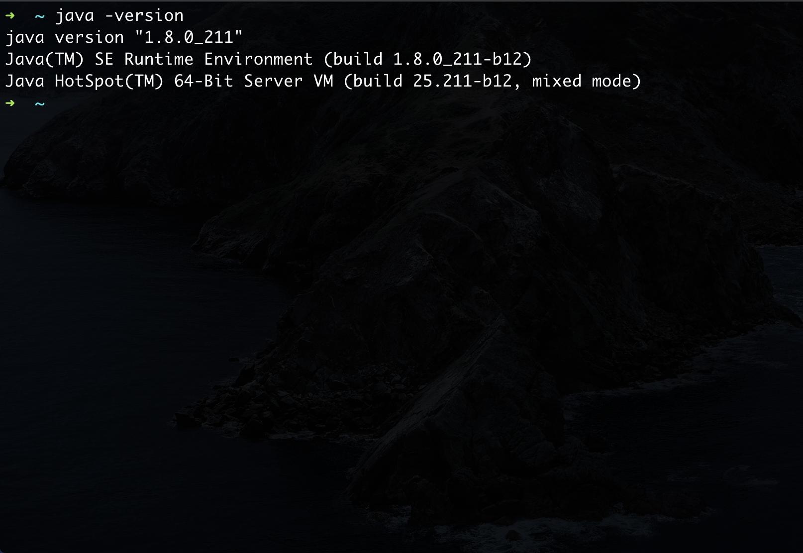

## oh-my-zsh

---

### 1.简介

​	oh-my-zsh	是一款精美的社区驱动的zsh配置管理框架。	

[github]: https://github.com/robbyrussell/oh-my-zsh	"zsh-github"

​	oh-my-zsh会使你向一个10x开发人员进发。

### 2.安装前准备

- 类Unix系统
- 安装ZSH
- 安装`curl` 或者 `wget`
- 安装`git`

### 3.安装

在终端执行下面任意一条命令

`sh -c "$(curl -fsSL https://raw.githubusercontent.com/robbyrussell/oh-my-zsh/master/tools/install.sh)"`

`sh -c "$(wget -O- https://raw.githubusercontent.com/robbyrussell/oh-my-zsh/master/tools/install.sh)"`

### 4.卸载

`sh -c "$(curl -fsSL https://raw.githubusercontent.com/robbyrussell/oh-my-zsh/master/tools/install.sh)" "" --unattended`

### 5.切换主题

编辑～/.zshrc

`ZSH_THEME="robbyrussell"`

//todo